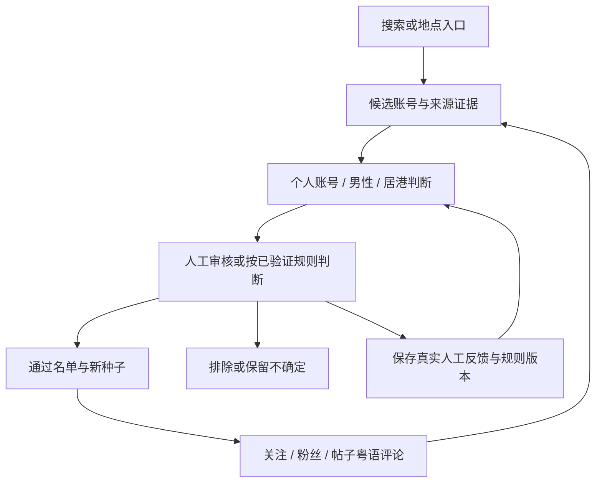

# Instagram 香港客户寻找 Skill

[](https://github.com/tianba777/instagram-hk-leads/actions/workflows/tests.yml)

供 AI agent 使用的 Instagram 名单整理 skill：从搜索或地点发现候选账号，沿合格种子的关注、粉丝和粤语评论继续寻找，并用本地 SQLite 保存证据、审核反馈和进度。

默认目标为在香港生活的男性普通个人账号。只交付名单，不发送私信，不执行关注、点赞或评论。

## 当前状态

| 部分 | 状态 |
| --- | --- |
| SQLite 记账工具 `scripts/leads.py` | 已实现，28 个本地测试覆盖；CI 在 Linux / Windows × Python 3.9 / 3.13 上运行 |
| 去重、固定编号批次、人工反馈历史、规则版本、三种审核模式、进度记录、CSV / JSON / Markdown 导出 | 已实现 |
| `batch --list` 找回未反馈批次、`ig_user_id` 防改名重复、`merge` 改名合并、`forget` 删除请求、自动入选审计、按条件统计人工否决、结构版本迁移 | 已实现（v2） |
| ego-browser 连接、Instagram 页面实际读取、完整找人流程 | **未实测**。`references/ego-browser.md` 里的示例只是文档契约，首次实测清单见该文件 |
| 多 agent 并行、第三方指纹浏览器 | 未实现，也不计划在没有实测数据前做 |

## 一个诚实的预期

筛选目标里的 `male` 要求本人公开自述，而绝大多数 Instagram 简介不写性别。所以在真实数据上，自动入选（三项 `yes` + 每项可追溯证据）预计很少触发，前几批以人工审核为主是正常的。`stats.pending_gate_blockers` 会统计待审账号被挡在哪一项，审过两三批后用它来决定要不要调整目标，而不是凭感觉。

## 寻找方式



首批审核目标是 20 个候选，不是搜索总量或层数上限。不同合格种子重复指向同一人会提高查看优先级，但出现次数不能代替身份和居港证据，也不能覆盖用户的排除决定。“学习”指保存人工反馈、总结筛选规则及调整寻找顺序，不是训练底层模型。

## 使用

需要 Python 3.9+，以及能读取 skill 文件、执行本地命令并调用 ego-browser 的 agent。Python 工具仅使用标准库。

```bash
git clone https://github.com/tianba777/instagram-hk-leads.git
cd instagram-hk-leads
```

让 agent 读取 [SKILL.md](SKILL.md) 并按其约定工作。示例任务：

> 使用 instagram-hk-leads，从 Instagram 当前可见的搜索或地点入口寻找在香港生活的男性普通个人账号，先提交最多 20 个候选让我审核；记录实际证据和来源，符合条件的账号可以继续成为种子。只读页面，不联系任何账号。

### 初始化与常用命令

```bash
DB=../instagram-hk-leads-data/leads.sqlite3       # 运行数据放在仓库外
python3 scripts/leads.py --db $DB init
python3 scripts/leads.py --db $DB stats
python3 scripts/leads.py --db $DB batch --limit 20
python3 scripts/leads.py --db $DB batch --list     # 接手时找回未反馈的批次
python3 scripts/leads.py --db $DB next
python3 scripts/leads.py --db $DB export --format csv --output ../instagram-hk-leads-data/accepted.csv
```

从 v1 数据库升级：`python3 scripts/leads.py --db $DB migrate`（先备份）。

完整命令、JSON 格式见 [references/database.md](references/database.md)；一轮流程填好后长什么样见 [examples/](examples/README.md)（全部虚构数据）。

## 文件

| 文件 | 用途 |
| --- | --- |
| [SKILL.md](SKILL.md) | agent 的筛选标准、寻找循环、模式和边界 |
| [references/ego-browser.md](references/ego-browser.md) | 浏览器调用、版本差异、首次实测清单 |
| [references/database.md](references/database.md) | 命令、JSON 格式及数据库行为 |
| [examples/](examples/README.md) | 虚构的端到端示例输入与输出 |
| [scripts/leads.py](scripts/leads.py) | Python / SQLite 命令行工具 |
| [tests/test_leads.py](tests/test_leads.py) | 使用合成记录和临时数据库的测试 |

## 测试

```bash
python3 -B -m unittest discover -s tests -v
```

测试不访问 Instagram，也不使用真实客户记录；测试通过不能代替浏览器实际运行验证。

## 数据与合规

数据库里是关于真实个人的资料：性别和居住地推断、简介和评论的短引文、社交关系。运行数据库、导出名单、审核反馈及浏览器登录资料只留在本机，不提交到公开仓库（`.gitignore` 已排除常见文件名）。收到本人删除要求时用 `forget`。

仅读取当前登录账号按正常页面权限可见的内容。遇到登录失效、验证、平台限制或用户接管时保存进度并暂停，不绕过限制，不持续重试；本 skill 不创建后台任务。使用者需自行确认这种收集方式符合 Instagram 服务条款和所在地（含香港《个人资料（私隐）条例》）的要求。

## 许可

[MIT](LICENSE)
