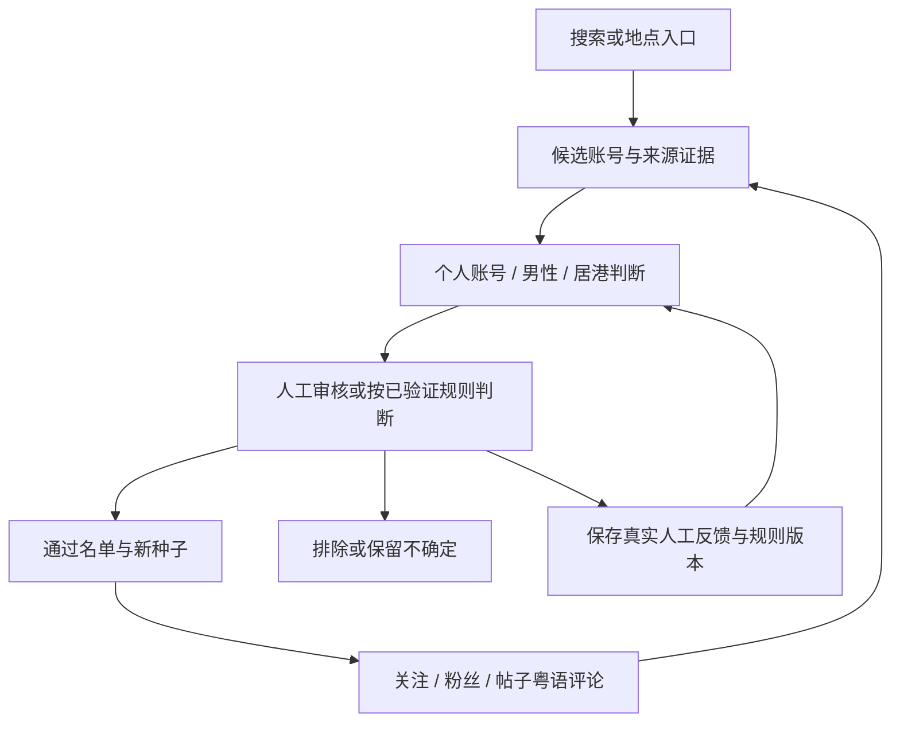

# Instagram 香港客户寻找 Skill

供 AI agent 使用的 Instagram 名单整理 skill：从搜索或地点发现候选账号，沿合格种子的关注、粉丝和粤语评论继续寻找，并用本地 SQLite 保存证据、审核反馈和进度。

默认目标为在香港生活的男性普通个人账号。只交付名单，不发送私信，不执行关注、点赞或评论。

## 当前状态

- 已实现：账号与来源去重、固定编号审核批次、人工反馈历史、规则版本、三种审核模式、入口进度及 CSV / JSON / Markdown 导出。
- 浏览器方案：[citrolabs/ego-lite](https://github.com/citrolabs/ego-lite) 提供的 `ego-browser`，由 agent 根据实际可见页面操作；本仓库不包含独立运行的 Instagram 爬虫。
- 验证范围：Python 数据库工具具有本地自动化测试；真实 Instagram 页面读取、ego-browser 连接及完整找人流程尚未实测。
- 当前版本面向单机顺序执行，未实现多个 agent 的任务领取与并行调度，也未接入第三方指纹浏览器。

## 寻找方式



首批审核目标是 20 个候选，不是搜索总量或层数上限。不同合格种子重复指向同一人会提高查看优先级，但出现次数不能代替身份和居港证据，也不能覆盖用户的排除决定。

“学习”指保存人工反馈、总结筛选规则及调整寻找顺序，不是训练底层模型；减少审核需要实际反馈支持，不会在固定轮数后自动启用。

## 使用

需要 Python 3.9+，以及能读取 skill 文件、执行本地命令并调用 ego-browser 的 agent。Python 工具仅使用标准库，无须安装额外 Python 依赖。

```bash
git clone https://github.com/tianba777/instagram-hk-leads.git
cd instagram-hk-leads
```

让 agent 读取本仓库的 [SKILL.md](SKILL.md)，并按照其约定工作；如需安装到某个 agent 的技能目录，使用该 agent 自身支持的安装方式。

示例任务：

> 使用 instagram-hk-leads，从 Instagram 当前可见的搜索或地点入口寻找在香港生活的男性普通个人账号，先提交最多 20 个候选让我审核；记录实际证据和来源，符合条件的账号可以继续成为种子。只读页面，不联系任何账号。

浏览器依赖的安装与调用方式见 [ego-browser 参考](references/ego-browser.md)，必须以实际安装版本为准。

### 初始化本地数据库

从仓库目录执行，将运行数据放在仓库外：

```bash
python3 scripts/leads.py --db ../instagram-hk-leads-data/leads.sqlite3 init
python3 scripts/leads.py --db ../instagram-hk-leads-data/leads.sqlite3 stats
```

实际任务应记录数据库的绝对路径，后续 agent 复用同一个文件。工具始终要求显式传入 `--db`，不会自动读取账号、登录浏览器或收集客户。

### 查看、审核与导出

```bash
# 已有真实候选记录时，生成固定编号审核批次
python3 scripts/leads.py --db ../instagram-hk-leads-data/leads.sqlite3 batch --limit 20

# 查看可继续读取的入口
python3 scripts/leads.py --db ../instagram-hk-leads-data/leads.sqlite3 next

# 默认仅导出通过名单，且不覆盖已有文件
python3 scripts/leads.py --db ../instagram-hk-leads-data/leads.sqlite3 export --format csv --output ../instagram-hk-leads-data/accepted.csv
```

账号导入、真实人工反馈、规则总结及进度文件格式见 [数据库命令说明](references/database.md)。文档中的账号名称为字段示例，不能当作真实候选导入。

## 文件

| 文件 | 用途 |
| --- | --- |
| [SKILL.md](SKILL.md) | agent 的筛选要求、寻找流程和操作范围 |
| [references/ego-browser.md](references/ego-browser.md) | 浏览器调用、版本差异与读取范围 |
| [references/database.md](references/database.md) | 命令、JSON 格式及数据库行为 |
| [scripts/leads.py](scripts/leads.py) | Python / SQLite 命令行工具 |
| [tests/test_leads.py](tests/test_leads.py) | 使用合成记录和临时数据库的测试 |

## 测试

```bash
python3 -B -m unittest discover -s tests -v
```

测试不访问 Instagram，也不使用真实客户记录；测试通过不能代替浏览器实际运行验证。

## 数据与操作范围

运行数据库、导出名单、审核反馈及浏览器登录资料应保留在本机，不提交到公开仓库。`.gitignore` 已排除常见运行数据和凭据文件；自定义文件名仍需在提交前检查。

仅读取当前登录账号按正常页面权限可见的内容。遇到登录失效、验证、平台限制或用户接管时保存进度并暂停，不绕过限制，不持续重试；本 skill 不创建后台任务。
